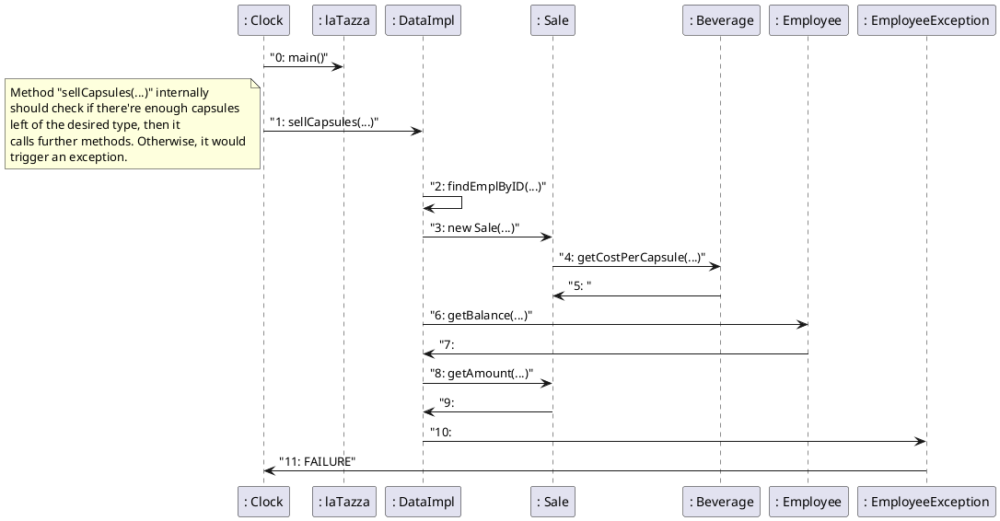

# Design Document Template

Authors:

Date:

Version:

# Contents

- [Package diagram](#package-diagram)
- [Class diagram](#class-diagram)
- [Verification traceability matrix](#verification-traceability-matrix)
- [Verification sequence diagrams](#verification-sequence-diagrams)

# Instructions

The design document has to comply with:
1. [Official Requirement Document](../Official\ Requirements\ Document.md)
2. [DataInterface.java](../src/main/java/it/polito/latazza/data/DataInterface.java)

UML diagrams **MUST** be written using plantuml notation.

# Package diagram

\<define UML package diagram >

\<explain rationales for choices> 

\<mention architectural patterns used, if any>
```plantuml
package "latazza" as LT{

}

package "latazza.gui" as UI{

}

package "latazza.data" as I{

}

package "latazza.exceptions" as E {

}

LT <.. UI
I ..> LT
E ..> LT
```

# Class diagram

\<for each package define class diagram with classes defined in the package>

\<mention design patterns used, if any>

```plantuml
Class "LaTazza" as LT {
void main(String[] args)
}

class "DataImpl" as DI{
+Integer CashAccount
+ArrayList<Beverage> beverages
+ArrayList<Employee> employees
+ArrayList<Transaction> operations

DataImpl()
Integer sellCapsules(Integer employeeId, Integer beverageId, Integer numberOfCapsules, Boolean fromAccount)
void sellCapsulesToVisitor(Integer beverageId, Integer numberOfCapsules)
Integer rechargeAccount(Integer id, Integer amountInCents)
void buyBoxes(Integer beverageId, Integer boxQuantity)
List<String> getEmployeeReport(Integer employeeId, Date startDate, Date endDate)
List<String> getReport(Date startDate, Date endDate) 
Integer createBeverage(String name, Integer capsulesPerBox, Integer boxPrice)
void updateBeverage(Integer id, String name, Integer capsulesPerBox, Integer boxPrice)
String getBeverageName(Integer id)
Integer getBeverageCost(Integer id)
Integer getBeverageCapsulesPerBox(Integer id)
Integer getBeverageBoxPrice(Integer id)
List<Integer> getBeveragesId()
Map<Integer, String> getBeverages()
Integer getBeverageCapsules(Integer id) 
Integer createEmployee(String name, String surname)
void updateEmployee(Integer id, String name, String surname)
Integer updateEmployeeBalance(Integer id)
String getEmployeeName(Integer id)
String getEmployeeSurname(Integer id)
Integer getEmployeeBalance(Integer id)
List<Integer> getEmployeesId()
Map<Integer, String> getEmployees()
Integer getBalance()
void reset()
void loadDatas()
void storeDatas()
Employee findEmplByID(Integer id)
Beverage findBevByID(Integer id)
LocalDateTime convertDate(Date date)
}

class "Employee" as E {
+Integer ID
+String name
+String surname
+ArrayList<Transaction> operations
+Integer balance

void addSale(Sale sale)
void addRechargeAccount(RechargeAccount recharge)
void updateBalance(Integer amountInCents, Boolean flag)
}

class "Beverage" as B{
+Integer ID
+Integer boxPrice
+String Name
+Integer capsulesPerBox
+Integer costPerCapsule

void updateQuantity(Integer numberOfCapsules)
void addQuantity(Integer boxQuantity)
}


class "Transaction" as T{
+Integer amount
+String dateString
+LocalDateTime date

abstract String createStringReport()
}

class "Sale" as S{
+Beverage beverage
+Employee employee
+Integer numberOfCapsules
+Boolean payWithAccount

String createStringReport()

}

class "Recharge Account" as RA{
+Employee employee

String createStringReport()
}

class "Purchase" as P {
+Integer boxQuantity
+Beverage beverage

String createStringReport()
}

class "Exception" as Ex {
    
}

class "Beverage Exception" as BEx {
    
}

class "Date Exception" as DEx {
    
}

class "Employee Exception" as EEx {
    
}

class "NotEnoughBalance" as NEBEx {
    
}

class "NotEnoughCapsules" as NECEx {
    
}
LT --> DI
DI --> T
DI --> E
DI --> B
S --> E
B <-- S
P --> B
S --|> T
RA --|> T
P --|> T
RA --> E
E --> T
BEx --|> Ex
DEx --|> Ex
EEx --|> Ex
NEBEx --|> Ex
NECEx --|> Ex
BEx <-- DI
DEx <-- DI
EEx <-- DI
NEBEx <-- DI
NECEx <-- DI
```

# Verification traceability matrix

\<for each functional requirement from the requirement document, list which classes concur to implement it>


|      | DataImpl | Employee | Beverage | Purchase | Sale | Recharge | Transaction |
| ---- | :------: | :------: | :------: | :------: | :--: | :------: | :---------: |
| FR1  |    x     |    x     |    x     |          |  x   |          |      x      |
| FR2  |    x     |          |    x     |          |  x   |          |      x      |
| FR3  |    x     |    x     |          |          |      |    x     |      x      |
| FR4  |    x     |          |    x     |    x     |      |          |      x      |
| FR5  |    x     |    x     |    x     |          |  x   |    x     |      x      |
| FR6  |    x     |    x     |    x     |    x     |  x   |    x     |      x      |
| FR7  |    x     |          |    x     |          |      |          |             |
| FR8  |    x     |    x     |          |          |      |          |             |

# Verification sequence diagrams 
\<select key scenarios from the requirement document. For each of them define a sequence diagram showing that the scenario can be implemented by the classes and methods in the design>


## Sequence diagram for Scenario 1
```plantuml

": Clock" -> ": laTazza": "0: main()"
": Clock" -> ": DataImpl": "1: sellCapsules(...)"
note left
        Method "sellCapsules(...)" internally
        should check if there're enough capsules 
        left of the desired type, then it 
        calls further methods. Otherwise, it would
        trigger an exception.
end note
": DataImpl" -> ": DataImpl": "2: findEmplByID(...)"
": DataImpl" -> ": Sale": "3: new Sale(...)"
": Sale" -> ": Beverage": "4: getCostPerCapsule(...)"
": Sale" <-": Beverage": "5: "
": DataImpl" -> ": DataImpl": "5: findBevByID(...)"
": DataImpl" -> ": Employee": "6: addSale(...)"
": Employee" -> ": DataImpl": "7: "

": DataImpl" -> ": Beverage": "8: updateQuantity(...)"
": Beverage" -> ": DataImpl": "9: "


": DataImpl" -> ": Employee": "10: updateBalance(...)"
": Employee" -> ": DataImpl": "11: "

": DataImpl" -> ": Sale": "12: getAmount(...)"
": Sale" -> ": DataImpl": "11: "

": DataImpl" -> ": Clock": "13: SUCCESS"

```


## Sequence diagram for Scenario 2


