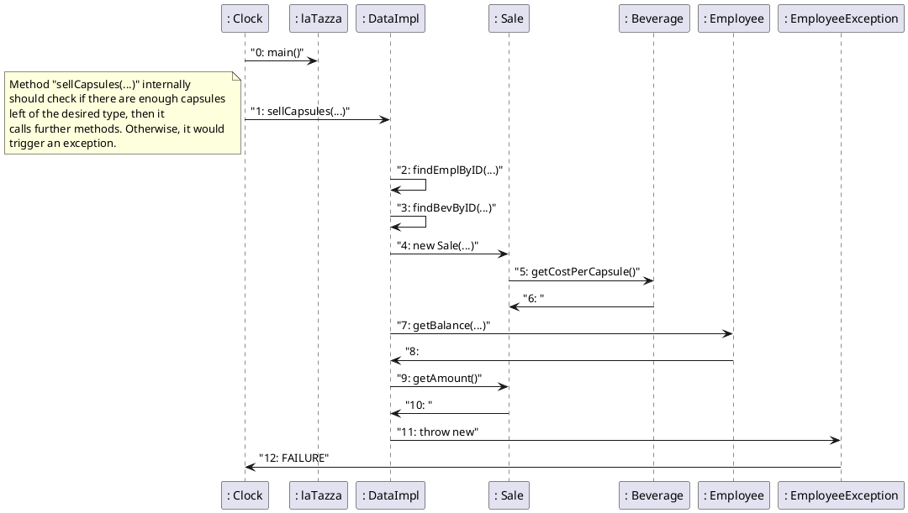

# Design Document Template

Authors: hip hip

Date: 22/04/2019

Version:

# Contents

- [Package diagram](#package-diagram)
- [Class diagram](#class-diagram)
- [Verification traceability matrix](#verification-traceability-matrix)
- [Verification sequence diagrams](#verification-sequence-diagrams)

# Instructions

The design document has to comply with:
1. [Official Requirement Document](../Official\ Requirements\ Document.md)
2. [DataInterface.java](../src/main/java/it/polito/latazza/data/DataInterface.java)


# Package diagram

```plantuml
package "latazza" as LT{

}


package "latazza.gui" as UI{

}

package "latazza.data" as I{

}

package "latazza.exceptions" as E {

}


LT <.. UI
I ..> LT
E ..> LT

```
``` plantuml
note left
        Layered pattern has been chosen as architectural 
        pattern, in fact DataImpl is the class that starts 
        the operation, then all the other methods are wrapped 
        in the remaining classes, that provide to finish the 
        task, updating all the datas and coming back to DataImpl.
end note
```

# Class diagram

```plantuml
Class "LaTazza" as LT {
void main(String[] args)
}

class "DataImpl" as DI{
+Integer CashAccount
+ArrayList<Beverage> beverages
+ArrayList<Employee> employees
+ArrayList<Transaction> operations

DataImpl()
Integer sellCapsules(Integer employeeId, Integer beverageId, Integer numberOfCapsules, Boolean fromAccount)
void sellCapsulesToVisitor(Integer beverageId, Integer numberOfCapsules)
Integer rechargeAccount(Integer id, Integer amountInCents)
void buyBoxes(Integer beverageId, Integer boxQuantity)
List<String> getEmployeeReport(Integer employeeId, Date startDate, Date endDate)
List<String> getReport(Date startDate, Date endDate) 
Integer createBeverage(String name, Integer capsulesPerBox, Integer boxPrice)
void updateBeverage(Integer id, String name, Integer capsulesPerBox, Integer boxPrice)
String getBeverageName(Integer id)
Integer getBeverageCost(Integer id)
Integer getBeverageCapsulesPerBox(Integer id)
Integer getBeverageBoxPrice(Integer id)
List<Integer> getBeveragesId()
Map<Integer, String> getBeverages()
Integer getBeverageCapsules(Integer id) 
Integer createEmployee(String name, String surname)
void updateEmployee(Integer id, String name, String surname)
Integer updateEmployeeBalance(Integer id)
String getEmployeeName(Integer id)
String getEmployeeSurname(Integer id)
Integer getEmployeeBalance(Integer id)
List<Integer> getEmployeesId()
Map<Integer, String> getEmployees()
Integer getBalance()
void reset()
void loadDatas()
void storeDatas()
Employee findEmplByID(Integer id)
Beverage findBevByID(Integer id)
LocalDateTime convertDate(Date date)
}


class "Employee" as E {
+Integer ID
+String name
+String surname
+ArrayList<Transaction> operations
+Integer balance

void addSale(Sale sale)
void addRechargeAccount(RechargeAccount recharge)
void updateBalance(Integer amountInCents, Boolean flag)
}

class "Beverage" as B{
+Integer ID
+Integer boxPrice
+String Name
+Integer capsulesPerBox
+Integer costPerCapsule

void updateQuantity(Integer numberOfCapsules)
void addQuantity(Integer boxQuantity)
}


class "Transaction" as T{
+Integer amount
+String dateString
+LocalDateTime date

abstract String createStringReport()
}

class "Sale" as S{
+Beverage beverage
+Employee employee
+Integer numberOfCapsules
+Boolean payWithAccount

String createStringReport()

}

class "Recharge Account" as RA{
+Employee employee

String createStringReport()
}

class "Purchase" as P {
+Integer boxQuantity
+Beverage beverage

String createStringReport()
}

class "Exception" as Ex {
    
}

class "Beverage Exception" as BEx {
    
}

class "Date Exception" as DEx {
    
}

class "Employee Exception" as EEx {
    
}

class "NotEnoughBalance" as NEBEx {
    
}

class "NotEnoughCapsules" as NECEx {
    
}
LT --> DI
DI --> T
DI --> E
DI --> B
S --> E
B <-- S
P --> B
S --|> T
RA --|> T
P --|> T
RA --> E
E --> T
BEx --|> Ex
DEx --|> Ex
EEx --|> Ex
NEBEx --|> Ex
NECEx --|> Ex
BEx <-- DI
DEx <-- DI
EEx <-- DI
NEBEx <-- DI
NECEx <-- DI

```
```plantuml
note left
        Facade pattern has been chose as design pattern,
        in fact the user can only interact with a single class,
        which hides all the work done by the other methods for 
        completing the selected task, acting as a client.
end note
```


# Verification traceability matrix


|      | DataImpl | Employee | Beverage | Purchase | Sale | Recharge | Transaction |
| ---- | :------: | :------: | :------: | :------: | :--: | :------: | :---------: |
| FR1  |    x     |    x     |    x     |          |  x   |          |      x      |
| FR2  |    x     |          |    x     |          |  x   |          |      x      |
| FR3  |    x     |    x     |          |          |      |    x     |      x      |
| FR4  |    x     |          |    x     |    x     |      |          |      x      |
| FR5  |    x     |    x     |    x     |          |  x   |    x     |      x      |
| FR6  |    x     |    x     |    x     |    x     |  x   |    x     |      x      |
| FR7  |    x     |          |    x     |          |      |          |             |
| FR8  |    x     |    x     |          |          |      |          |             |

# Verification sequence diagrams 


## Sequence diagram for Scenario 1
```plantuml

": Clock" -> ": laTazza": "0: main()"
": Clock" -> ": DataImpl": "1: sellCapsules(...)"
note left
        Method "sellCapsules(...)" internally
        should check if there are enough capsules 
        left of the desired type, then it 
        calls further methods. Otherwise, it would
        trigger an exception.
end note
": DataImpl" -> ": DataImpl": "2: findEmplByID(...)"
": DataImpl" -> ": DataImpl": "3: findBevByID(...)"
": DataImpl" -> ": Sale": "4: new Sale(...)"
": Sale" -> ": Beverage": "5: getCostPerCapsule()"
": Sale" <-": Beverage": "6: "

": DataImpl" -> ": Beverage": "7: getTotalQuantity()"
": DataImpl" <-": Beverage": "8: "


": DataImpl" -> ": Employee": "9: addSale(...)"
": Employee" -> ": DataImpl": "10: "

": DataImpl" -> ": Beverage": "11: updateQuantity(...)"
": Beverage" -> ": DataImpl": "12: "


": DataImpl" -> ": Employee": "13: updateBalance(...)"
": Employee" -> ": DataImpl": "14: "

": DataImpl" -> ": Sale": "15: getAmount()"
": Sale" -> ": DataImpl": "16: "

": DataImpl" -> ": Clock": "17: SUCCESS"

```


## Sequence diagram for Scenario 2


